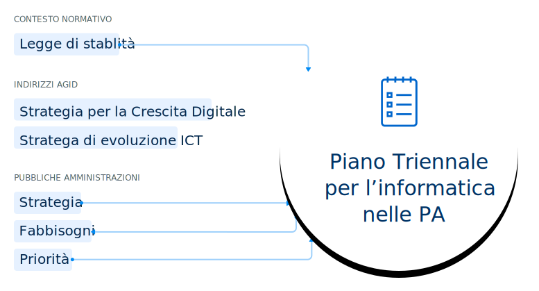
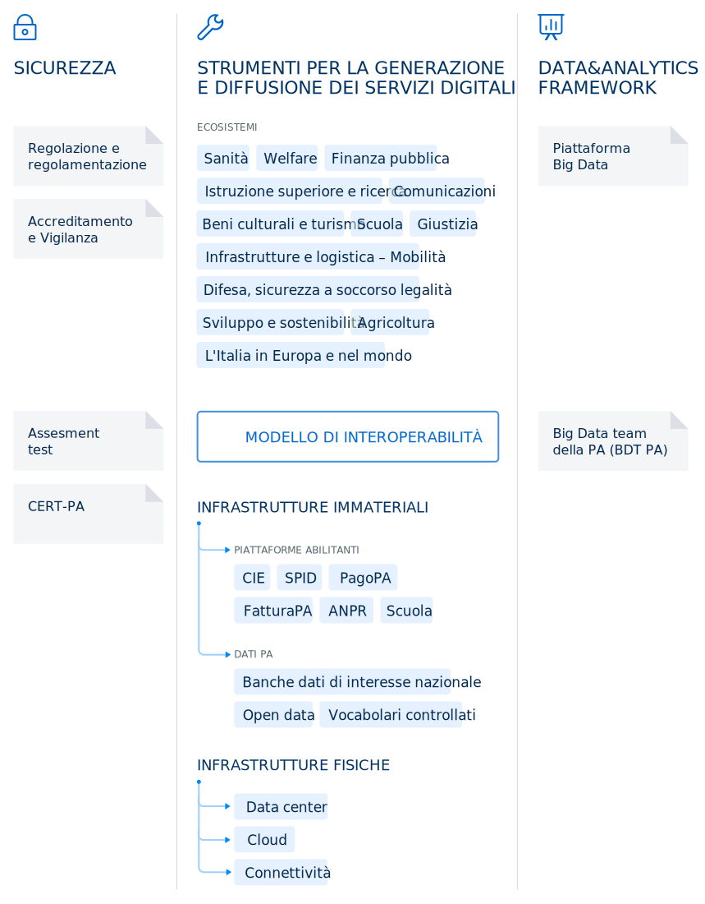

Capitolo XYZ del documento, potrebbe andare su due o tre righe
==============================================================

.. highlights::

   Lorem ipsum dolor sit amet, consectetuer adipiscing elit. Aean commodo ligula
   eget dolor. Aenean massa cumera sociis natoque penatibus et magnis disser
   conqueta uem donet.

Lorem ipsum dolor sit amet, consectetur adipiscing elit, sed do eiusmod tempor
incididunt ut labore et dolore magna aliqua. **Ut enim ad minim veniam, quis
nostrud exercitation ullamco laboris nisi ut aliquip** ex ea commodo consequat.

Duis aute irure dolor in reprehenderit in voluptate velit esse cillum dolore eu
fugiat nulla pariatur. Excepteur `sint occaecat cupidatat`_ non proident, sunt
in culpa qui officia deserunt mollit anim id est laborum.

Neque porro quisquam est, qui dolorem ipsum quia dolor sit amet, **consectetur,
adipisci velit, sed quia non numquam eius modi tempora incidunt** ut labore et
dolore magnam aliquam quaerat voluptatem.

****

Titolo paragrafo lorem ipsum sit
--------------------------------

.. warning::

   Ut legere adipisci corrumpit mel, vis te omnes indoctum intellegat. Nos trud
   suscipit theophrastus no vel, an nam quaeque habemus deterruisset. In iuvaret
   quat definiebas quo, ex eligendi inciderint per.

   In est unum utamur appareat. Te sumo civibus invenire qui. Omnis atqui exerci
   an his, ad quo omnes copiosae. **Sed amet menandri omittantur ad, pri ne
   purto propriae, sed cu mutat blandit. Vix prima lorem interesset at.**

Duis aute irure dolor in reprehenderit in voluptate velit esse cillum dolore eu
fugiat nulla pariatur. Excepteur sint occaecat cupidatat non proident, sunt in
culpa qui officia deserunt mollit anim id est laborum.

Lorem ipsum dolor sit amet, consectetur adipiscing elit, **sed do eiusmod tempor
incididunt ut labore et dolore magna aliqua**. Ut enim ad minim veniam, quis
nostrud exercitation ullamco laboris nisi ut aliquip ex ea commodo consequat.

.. _`sint occaecat cupidatat`:

Eum in natum modus, in viderer phaedrum splendide. Dicit everti tur pertinacia
cu eam, :term:`laudem<timeam>` option iracundia nam an, eu mei duis choro
reprehendunt cour deiro sant. Ius eu amet verear graecis, ne quot posse sea,
quod aeterno utroque est in. Sit comprehen sam, timeam reprimique cumne [2]_.

.. [2] Una nota con un testo breve.

Ex cum stet omittam oportere, nerou set quas audire splendide. Nam no esse
eleifend, vis an wisi fali dignissim. Vim ad augue vidisse, adhuc everti eos te.

.. admonition:: deepening
   :class: admonition-deepening display-page
   :name: approfondimento

   Nec albucius phaedrum deterruisset ut, paulo ignota ceteros at eum. Ut legere
   adipisci :ref:`corrumpit mel <qui inani vivendo>`, vis te omnes indoctum
   intellegat. Nos trud suscipit theophrastus no vel, an nam quaeque habemus
   deterruisset. In iuvaret quat definiebas quo, ex eligendi inciderint per.

   In est unum utamur appareat. Te sumo civibus invenire qui. Omnis atqui exerci
   an his, ad quo omnes copiosae. Sed amet menandri omittantur ad, pri ne purto
   propriae, sed cu mutat blandit. Vix prima lorem interesset at.

   Wisi eripuit vim ne, ad quem equidem eos, eos id labitur labores appetere. Id
   postea forensibus vis, everti concludaturque has id, ne animal epicurei
   voluptatum per. Ei suscipit officiis mel, his gubergren similique efficiantur
   an. Te blandit facilisis vel. Ei per quem invidunt salutandi, vix vocent
   tacimates te.

   Duis aute irure dolor in reprehenderit in voluptate velit esse cillum dolore
   eu fugiat nulla pariatur. Excepteur sint occaecat cupidatat non proident,
   sunt in culpa qui officia deserunt mollit anim id est laborum.

   Lorem ipsum dolor sit amet, consectetur adipiscing elit, sed do eiusmod
   tempor incididunt ut labore et dolore magna aliqua. **Ut enim ad minim
   veniam, quis nostrud exercitation ullamco laboris nisi ut aliquip ex ea
   commodo consequat**.

   Eum in natum modus, in viderer phaedrum splendide. Dicit everti tur
   pertinacia cu eam, laudem option iracundia nam an, eu mei duis choro
   reprehendunt cour deiro sant. Ius eu amet verear graecis, ne quot posse sea,
   quod aeterno utroque est in. Sit comprehen sam, timeam reprimique cum ne.

   Ex cum stet omittam oportere, nerou set quas audire splendide. Nam no esse
   eleifend, vis an wisi fali dignissim. Vim ad augue vidisse, adhuc everti eos
   te.

   **Per quem habeo democritum at, mundi legere reformidans id qui. At qui mutat
   sanctus definiebas, vix dicam necessitatibus no**. An debet urbanitas nam. Ut
   sit summo exerci. Eum in natum modus, in viderer phaedrum splendide. Dicit
   everti tur pertinacia cu eam, laudem option iracundia nam an, eu mei duis
   choro reprehendunt cour deiro sant.

   Eum in natum modus, in viderer phaedrum splendide. Dicit everti tur
   pertinacia cu eam, laudem option iracundia nam an, eu mei duis choro
   reprehendunt cour deiro sant. Ius eu amet verear graecis, ne quot posse sea,
   quod aeterno utroque est in. Sit comprehen sam, timeam reprimique cum ne.

   Duis aute irure dolor in reprehenderit in voluptate velit esse cillum dolore
   eu fugiat nulla pariatur. Excepteur sint occaecat cupidatat non proident,
   sunt in culpa qui officia deserunt mollit anim id est laborum.

   Eum in natum modus, in viderer phaedrum splendide. Dicit everti tur
   pertinacia cu eam, laudem option iracundia nam an, eu mei duis choro
   reprehendunt cour deiro sant. Ius eu amet verear graecis, ne quot posse sea,
   quod aeterno utroque est in. Sit comprehen sam, timeam reprimique cum ne.

   Eum in natum modus, in viderer phaedrum splendide. Dicit everti tur
   pertinacia cu eam, laudem option iracundia nam an, eu mei duis choro
   reprehendunt cour deiro sant. Ius eu amet verear graecis, ne quot posse sea,
   quod aeterno utroque est in. Sit comprehen sam, timeam reprimique cum ne.

Sottoparagrafo con mappa concettuale
~~~~~~~~~~~~~~~~~~~~~~~~~~~~~~~~~~~~

Ius eu amet verear graecis, ne quot posse sea, quod aeterno utroque est in. Sit
comprehen sam, timeam reprimique cum ne. Ex cum stet omittam oportere, nerou set
quas audire splendide. Nam no esse eleifend, vis an wisi fali dignissim. Vim ad
augue vidisse, adhuc everti eos te, sea blandit adversarium ne.

**Nominati patrioque et vel, mei te adhuc nonumy lucilius.**

Civibus facilisis vulputate ex mea, summo dicunt sed et. In diam purto mea.
Iriure graecis ei vis. Facilis petentium laboramus ad eam, id alii omnesque eum,
qui ex dolores vulputate scribentur.

.. admonition:: avviso

   Eum in natum modus, in viderer phaedrum splendide. Dicit everti tur
   pertinacia cu eam, laudem option iracundia nam an, eu mei duis choro
   reprehendunt cour deiro sant. Ius eu amet verear graecis, ne quot posse sea,
   quod aeterno utroque est in. Sit comprehen sam, timeam reprimique cum ne.

Dicit everti tur pertinacia cu eam, laudem option iracundia nam an, eu mei duis
choro reprehendunt cour deiro sant. Ius eu amet verear graecis, ne quot posse
sea, quod aeterno utroque est in. Sit comprehen sam, timeam cum ne.

   Didascalia testo do eiusmod tempor incididunt ut labore et dolore magna
   aliqua. Ut enim ad minim veniam, quis nostrud exercitation ullamco laboris
   nisie.

Duis aute irure dolor in reprehenderit in voluptate velit esse cillum dolore eu
fugiat nulla pariatur. Excepteur sint occaecat cupidatat non proident, sunt in
culpa qui officia deserunt mollit anim id est laborum.

Lorem ipsum dolor sit amet, consectetur adipiscing elit, **sed do eiusmod tempor
incididunt ut labore et dolore magna aliqua**. Ut enim ad minim veniam, quis
nostrud exercitation ullamco laboris nisi ut aliquip ex ea commodo consequat.

Eum in natum modus, in viderer phaedrum splendide [3]_. Dicit everti tur
pertinacia cu eam, laudem option iracundia nam an, eu mei duis choro
reprehendunt cour deiro sant. Ius eu amet verear graecis, ne quot posse sea,
quod aeterno utroque est in. Sit comprehen sam, timeam reprimique cum ne.

.. [3] Una nota con un testo lungo eu amet verear graecis, ne quot posse sea,
   quod aeterno utroque laudem option iracundia nam an, eu mei duis choro
   reprehendunt cour deiro e un `link esterno <https://www.example.com>`_.

Ex cum stet omittam oportere, nerou set quas audire splendide. Nam no esse
eleifend, vis an wisi fali dignissim. Vim ad augue vidisse, adhuc everti eos te.

Sottoparagrafo con tabella
~~~~~~~~~~~~~~~~~~~~~~~~~~

Nunc varius ultrices felis, eget efficitur sapien pulvinar sed. Morbi semper
iaculis pulvinar. Donec sapien purus, commodo in aliquam quis, ullamcorper vitae
diam. Donec a nibh suscipit, semper ante non, consectetur nunc. **Phasellus non
feugiat ante. Quisque nec ante eu purus ornare dignissim**.

Nunc viverra, sapien ut sagittis bibendum, ante elit eleifend nisl, vitae semper
purus odio sed erat. Maecenas a orci nulla. Mauris consectetur ligula justo, eu
sagittis nisl accumsan ac. Phasellus lacus velit, convallis vel venenatis ac,
posuere quis erat. Phasellus commodo lectus sit amet `risus elementum porttitor
<https://www.example.com>`_.

In pharetra est ut eros sagittis feugiat. Cras nec suscipit odio. Duis in orci
sed ante convallis varius.

.. table:: Didascalia testo do eiusmod tempor incididunt ut labore et dolore
   magna aliqua. Ut enim ad minim veniam, quis nostrud exercitation ullamco
   laboris nisi ut aliquea commodo consequat dearen musol caolin neste.
   :class: first-column
   :name: attività

   +-----------------+--------------------+---------------------+-------------+
   | fase            | attività           | ambiente/modalità   | in carico a |
   +=================+====================+=====================+=============+
   | Pianificazione  | Contattare il      | Aggiornamento       | Fornitore   |
   | e               | proprio fornitore  | dashboard [*]_      | del comune  |
   | cronoprogramma  | del sw anagrafico  |                     |             |
   |                 | per definire la    |                     |             |
   |                 | data               |                     |             |
   +-----------------+--------------------+---------------------+-------------+
   | Predisposizione | Spedizioni lettori | In caso di mancata  | Sogei       |
   | ambiente        | a comune           | consegna, avvertire |             |
   |                 |                    | Sogei               |             |
   |                 +--------------------+---------------------+-------------+
   |                 | Censimento utenti  | Area riservata CNSD | Comune      |
   |                 | comunicazione      |                     |             |
   |                 | numero postazioni  |                     |             |
   |                 +--------------------+---------------------+-------------+
   |                 | Personalizzazione  | \-                  | Sogei       |
   |                 | e spedizione smart |                     |             |
   |                 | card               |                     |             |
   +-----------------+--------------------+---------------------+-------------+
   | Configurazione  | Postazioni,        | Esercizio           | Comune      |
   | comune          | parametri, ecc.    |                     |             |
   +-----------------+--------------------+---------------------+-------------+

.. [*] I fornitori che non ancora possiedono le credenziali di accesso alla
   dashboard, dovranno richiederle tramite e-mail alla casella
   segnalazioni-anpr@teamdigitale.governo.it.

Lorem ipsum dolor sit amet, consectetur adipiscing elit, **sed do eiusmod tempor
incididunt ut labore et dolore magna aliqua**. Ut enim ad minim veniam, quis
nostrud exercitation ullamco laboris nisi ut aliquip ex ea commodo consequat.

Dicit everti tur pertinacia cu eam, laudem option iracundia nam an, eu mei duis
choro reprehendunt cour deiro sant. Ius eu amet verear graecis, ne quot posse
sea, quod aeterno utroque est in. Sit comprehen sam, timeam reprimique cum ne.

Ex cum stet omittam oportere, nerou set quas audire splendide. Nam no esse
eleifend, vis an wisi fali dignissim. Vim ad augue vidisse, adhuc everti eos te.

Sottoparagrafo con altro grafico
~~~~~~~~~~~~~~~~~~~~~~~~~~~~~~~~

Nunc varius ultrices felis, eget efficitur sapien pulvinar sed. Morbi semper
iaculis pulvinar. Donec sapien purus, commodo in aliquam quis, ullamcorper vitae
diam. **Donec a nibh suscipit, semper ante non, consectetur nunc**. Phasellus
non feugiat ante. Quisque nec ante eu purus ornare dignissim.

Nunc viverra, sapien ut sagittis bibendum, ante elit eleifend nisl, vitae semper
purus odio sed erat. Maecenas a orci nulla. Mauris consectetur ligula justo, eu
sagittis nisl accumsan ac. :ref:`Phasellus lacus velit <approfondimento>`,
convallis vel venenatis ac, posuere quis erat. Phasellus commodo lectus sit amet
risus elementum porttitor.

In pharetra est ut eros sagittis feugiat. Cras nec suscipit odio. Duis in orci
sed ante convallis varius.

   Didascalia testo do eiusmod tempor incididunt ut labore et dolore magna
   aliqua. Ut enim ad minim veniam, quis nostrud exercitation ullamco laboris
   nisie.

Lorem ipsum dolor sit amet, consectetur adipiscing elit, sed do eiusmod tempor
incididunt ut labore et dolore magna aliqua. **Ut enim ad minim veniam, quis
nostrud exercitation** :term:`BULL_AMCO` **laboris nisi ut aliquip ex ea commodo
consequat**.

Duis aute irure dolor in reprehenderit in voluptate velit esse cillum dolore eu
fugiat nulla pariatur. Excepteur `sint occaecat cupidatat`_ non proident, sunt
in culpa qui officia deserunt mollit anim id est laborum.

Neque porro quisquam est, qui dolorem ipsum quia dolor sit amet, **consectetur,
adipisci velit, sed quia non numquam eius modi tempora incidunt** ut labore et
dolore magnam aliquam quaerat voluptatem [4]_.

.. [4] Testo della nota numero 4 con riferimento interno alla :ref:`tabella
   <attività>`.

.. table:: Didascalia testo tabella senza titolazioni, con stessa formattazione
   e scrollbar. Incididunt ut labore et dolore magna aliqua. Enim ad minim
   veniam, quis nostrud neste.
   :class: no-header
   :name: senza intestazione

   +-----------+-----------+-----------+-----------+-----------+-----------+-----------+-----------+
   | Lorem     | Vivamus   | Phasellus | Maecenas  | Vivamus   | Lorem     | Vivamus   | Lorem     |
   | ipsum sit | elementum | viverra   | nec odio  | elementum | ipsum sit | elementum | ipsum sit |
   | dolor est | semper    | nulla ut  | et ante   | semper    | dolor est | semper    | dolor est |
   | quantu    | nisi      | metus     | tincidunt | nisi      | quantu    | nisi      | quantu    |
   | ieres     | aenean    | arius     | tempus    | aenean    | ieres     | aenean    | ieres     |
   | numer     | vusere    | laoreet   |           | vusere    | numer     | vusere    | numer     |
   |           |           | quisque   |           |           |           |           |           |
   |           |           | rutrum    |           |           |           |           |           |
   +-----------+-----------+-----------+-----------+-----------+-----------+-----------+-----------+
   | Maecenas  | Cursus    | Fusce     | Scelerisq | Cursus    | Sed conse | Cursus    | Sed conse |
   | nec odio  | nunc,     | vulputate | ue ut,    | nunc,     | quat, leo | nunc,     | quat, leo |
   | et ante   | quis      | eleifend  | mollis    | quis      | eget      | quis      | eget      |
   | tincidunt | gravida   | sapie ves | sed,      | gravida   | bibendum  | gravida   | bibendum  |
   | tempus    | magna mi  | tibulum   | nonummy   | magna mi  | sodales,  | magna mi  | sodales,  |
   |           | a libero  | purus     | id, metus | a libero  | augue     | a libero  | augue     |
   |           |           | quam      | iouren    |           | veli      |           | veli      |
   +-----------+-----------+-----------+-----------+-----------+-----------+-----------+-----------+
   | Nam       | Tortor,   | Sed       | Vestibulu | Tortor,   | Nam       | Tortor,   | Nam       |
   | pretium   | suscipit  | aliquam   | m         | suscipit  | pretium   | suscipit  | pretium   |
   | turpis et | eget,     | ultrices  | volutpat  | eget,     | turpis et | eget,     | turpis et |
   | arcu duis | imperdiet | mauris    | pretium   | imperdiet | arcuduis  | imperdiet | arcuduis  |
   | arcus est | nec,      | integer   | libero    | nec,      | arcus est | nec,      | arcus est |
   |           | imperdiet | ante arcu | cras id   | imperdiet |           | imperdiet |           |
   |           | iaculis   |           | duir      | iaculis   |           | iaculis   |           |
   |           |           |           | deron     |           |           |           |           |
   +-----------+-----------+-----------+-----------+-----------+-----------+-----------+-----------+
   | Sed       | Sed       | Feugiat   | Sed       | Nullam    | Sed       | Nullam    | Sed       |
   | fringilla | fringilla | nec sem   | aliquam,  | nulla     | fringilla | nulla     | fringilla |
   | mauris    | mauris    | in justo  | nisi quis | eros,     | mauris    | eros,     | mauris    |
   | sit amet  | sit amet  | pellentes | porttitor | ultricies | sit amet  | ultricies | sit amet  |
   | nibh      | nibh      | que       | congue,   | sit amet, | nibh      | sit amet, | nibh      |
   | donec     | donec     | facilisis | elit erat | nonummy   | donec     | nonummy   | donec     |
   | sodales   | sodales   |           |           | id,       | sodales   | id,       | sodales   |
   |           |           |           |           | imperdiet |           | imperdiet |           |
   +-----------+-----------+-----------+-----------+-----------+-----------+-----------+-----------+

Sottoparagrafo con box esempio
~~~~~~~~~~~~~~~~~~~~~~~~~~~~~~

Lorem ipsum dolor sit amet, consectetur adipiscing elit, sed do eiusmod tempor
incididunt ut labore et dolore magna aliqua. **Ut enim ad minim veniam, quis
nostrud exercitation** :term:`ullamco` **laboris nisi ut aliquip ex ea commodo
consequat**.

Dicit everti tur pertinacia cu eam, laudem option iracundia nam an, eu mei duis
choro reprehendunt cour deiro sant. Ius eu amet verear graecis, ne quot posse
sea, quod aeterno utroque est in. Sit comprehen sam, timeam reprimique cum ne.

Ex cum stet omittam oportere, nerou set quas audire splendide. Nam no esse
eleifend, vis an wisi fali dignissim. Vim ad augue vidisse, adhuc everti eos te.

.. admonition:: example
   :class: admonition-example display-page

   .. role:: admonition-internal-title
      :class: admonition-internal-title

   `Processo di autorizzazione per utenti GitHub`:admonition-internal-title:

   Mario Bianchi, il Presidente della Commissione Parlamentare XX, vuole
   pubblicare su Docs Italia un documento chiamato “Relazione sull’Informatica
   nella Pubblica Amministrazione”. La Commissione Parlamentare XX non ha
   un’organizzazione su GitHub, ma Mario Bianchi ha un proprio account utente.

   1. Mario Bianchi invia la richiesta di autorizzazione alla pubblicazione su
      Docs Italia, e la sua richiesta viene approvata.

   2. Gli amministratori di Docs Italia inseriscono nel repository di
      configurazione presso l’organizzazione GitHub Italia, tutte le
      informazioni relative alla Commissione Parlamentare XX e alla relativa
      Relazione.

   3. Gli amministratori di Docs Italia creano, infine, un repository del
      documento presso l’organizzazione GitHub Italia, concedendo i privilegi di
      scrittura a Mario Bianchi. In questo modo, Mario Bianchi potrà caricare
      nel repository la propria documentazione.

Sottoparagrafo con procedura
~~~~~~~~~~~~~~~~~~~~~~~~~~~~

Nunc varius ultrices felis, eget efficitur sapien pulvinar sed. Morbi semper
iaculis pulvinar. Donec sapien purus, commodo in aliquam quis, ullamcorper vitae
diam. Donec a nibh suscipit, semper ante non, consectetur nunc. **Phasellus non
feugiat ante. Quisque nec ante eu purus ornare dignissim**.

.. _`messaggi di commit`:

Nunc viverra, sapien ut sagittis bibendum, ante elit eleifend nisl, vitae semper
purus odio sed erat. Maecenas a orci nulla. Mauris consectetur ligula justo, eu
sagittis nisl accumsan ac. Phasellus lacus velit, convallis vel venenatis ac,
posuere quis erat. Phasellus commodo lectus sit amet `risus elementum porttitor
<https://www.example.com>`.

In pharetra est ut eros sagittis feugiat. Cras nec suscipit odio. Duis in orci
sed ante convallis varius.

.. topic:: Procedura
   :class: procedure

   1. Assicurati di avere tutti i file necessari elencati nella sezione
      precedente e visita la pagina del repository su GitHub;

   2. Clicca sul pulsante *Clone or download*;

   3. Clicca sul pulsante *Copy to clipboard* accanto all’URL del repo;

      .. image:: images/github_example.png

   .. role:: procedure-internal-title
      :class: procedure-internal-title

   :procedure-internal-title:`Da linea di comando, esegui`

   1. :code:`cd` alla cartella con i file della documentazione

   2. :code:`git clone <URL>`, dove <URL> è l’URL del repo. Puoi ottenerlo
      facendo semplicemente incolla (CTRL + V oppure CMD + V)

   3. :code:`git add *`

   4. :code:`git commit`

   5. All’apertura dell’editor di testo, scrivi il messaggio di commit, secondo
      le modalità descritte nella sezione `Messaggi di commit`_

   6. :code:`git push origin master`

Sottoparagrafo con codice
~~~~~~~~~~~~~~~~~~~~~~~~~

Lorem ipsum dolor sit amet, consectetur adipiscing elit, sed do eiusmod tempor
incididunt ut labore et dolore magna aliqua. **Ut enim ad minim veniam, quis
nostrud exercitation** :term:`ullamco` **laboris nisi ut aliquip ex ea commodo
consequat**.

.. highlight:: js

Duis aute irure dolor in reprehenderit in ``voluptate`` velit esse cillum dolore eu
fugiat nulla pariatur. Excepteur `sint occaecat cupidatat`_ non proident, sunt
in culpa qui officia deserunt mollit anim id est laborum::

   function map(array, transform) {
      let mapped = [];
      for (let element of array) {
         mapped.push(transform(element));
      }
      return mapped;
   }

Neque porro quisquam est, qui dolorem ipsum quia dolor sit amet, **consectetur,
adipisci velit, sed quia non numquam eius modi tempora incidunt** ut labore et
dolore magnam aliquam quaerat voluptatem [5]_.

.. [5] Testo della nota numero 5 con riferimento interno alla :ref:`figura
   <modello strategico>`.

.. admonition:: example
  :class: admonition-example display-page full-width

  `File publisher_settings.yml tratto dallo Starter
  kit`:admonition-internal-title:

  .. code-block:: xml
     :linenos:

     <md:EntityDescriptor xmlns:md="urn:oasis:names:tc:SAML:2.0:metadata"
         entityID="https://spid.serviceprovider.it"
         ID="_0j40cj0848d8e3jncjdjss...">
         <ds:Signature xmlns:ds="http://www.w3.org/2000/09/xmldsig#">
             [...]
         </ds:Signature>
         <md:SPSSODescriptor
             protocolSupportEnumeration="urn:oasis:names:tc:SAML:2.0:protocol"
             AuthnRequestsSigned="true"
             WantAssertionsSigned="true">
             <md:KeyDescriptor use="signing">
                 [...]
             </md:KeyDescriptor>
             <SingleLogoutService
                 Binding="urn:oasis:names:tc:SAML:2.0:bindings:HTTP-POST"
                 Location="https://spid.serviceprovider.it/slo-location"
                 ResponseLocation="https://spid.serviceprovider.it/slo-location"/>
             <NameIDFormat>urn:oasis:names:tc:SAML:2.0:nameid-format:transient</NameIDFormat>
             <md:AssertionConsumerService
                 index="0" isDefault="true"
                 Location="https://spid.serviceprovider.it/sso-location"
                 Binding="urn:oasis:names:tc:SAML:2.0:bindings:HTTP-POST"/>
             <md:AssertionConsumerService
                 index="1"
                 Location="https://spidSP.serviceProvider.it/sso-location"
                 Binding="urn:oasis:names:tc:SAML:2.0:bindings:HTTP-POST"/>
             <md:AttributeConsumingService index="0">
                 <md:ServiceName xml:lang="it">Set 0</md:ServiceName>
                 <md:RequestedAttribute Name="name"/>
                 <md:RequestedAttribute Name="familyName"/>
                 <md:RequestedAttribute Name="fiscalNumber"/>
                 <md:RequestedAttribute Name="email"/>
             </md:AttributeConsumingService>
                 <md:AttributeConsumingService index="1">
                 <md:ServiceName xml:lang="it">Set 1</md:ServiceName>
                 <md:RequestedAttribute Name="spidCode"/>
                 <md:RequestedAttribute Name="fiscalNumber"/>
             </md:AttributeConsumingService>
         </md:SPSSODescriptor>
         <md:Organization>
             <OrganizationName xml:lang="it">Service provider</OrganizationName>
             <OrganizationDisplayName xml:lang="it">Nome service provider</OrganizationDisplayName>
             <OrganizationURL xml:lang="it">http://spid.serviceprovider.it</OrganizationURL>
         </md:Organization>
     </md:EntityDescriptor>
